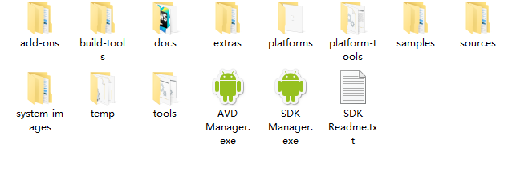

### 关于Android开发的一些细节回顾
&nbsp;&nbsp;&nbsp;&nbsp;&nbsp;&nbsp;事实上,之前并没有深究关于**Android**的相关东西，因为一直觉得做的人太多，没有什么实用的价值。  
&nbsp;&nbsp;&nbsp;&nbsp;&nbsp;&nbsp;但是，最近实验室有同学用到了增强现实的技术来实现车间的制造过程的建模，在模型实现过程中用到了Android的相关技术，有调用手机摄像头来实现**增强现实**，我才突然发现，我可能忽略一个一直存在的事实:Android只是一个实现平台，可以在这个平台上实现很多想法和创意，包括很多科研研究。正好很多横向项目也是关于移动终端的应用的，所以有些创新是可以在学习某一项技能的同时，将自己的一些想法通过学习的技能实现出来。  
&nbsp;&nbsp;&nbsp;&nbsp;&nbsp;&nbsp;在所有现在已经学技能中，可以用来实现想法的最合适的工具也就是我一直说的那三种语言:**MATLAB** , **JavaScript** , **Python**   
&nbsp;&nbsp;&nbsp;&nbsp;&nbsp;&nbsp;**MATLAB** 用MATLAB来将想法提炼成为模型和数学公式,特别适合将有理论支撑的想法或者学习新的理论和学术知识,众所周知，MATLAB的强大在于它的数据处理能力，将思路建模后，用理论来分析所有可能发生的情况，以及评估是否可行，这种能力很关键,也想慢慢拥有,渐渐学会使用。

&nbsp;&nbsp;&nbsp;&nbsp;&nbsp;&nbsp;**Python** 是应用很广泛的语言,可以通过简短的编码实现较为复杂的处理，可以较为方便地实现机器学习,神经网络的训练，以及之前使用的网络爬虫等等，使用Python会有简洁干练的感觉，对于快速实现想法有很大帮助。  

&nbsp;&nbsp;&nbsp;&nbsp;&nbsp;&nbsp;**JavaScript** 是所有浏览器通用的脚本语言，对于想要使用Web平台来实现的想法，除了基本的前端页面显示之外，对DOM的处理是很关键的，因为动态显示结果,以及实现动态的过程都需要控制,脚本语言的好处在于没有那么多限制，拿来就用，这点对于实现想法很关键。  

&nbsp;&nbsp;&nbsp;&nbsp;&nbsp;&nbsp;有了实现想法的工具，缺的其实也不是想法，而是实现想法的激情和勇气，以及坚持，不管怎么样，还是要坚持去做。

### 关于Android SDK的一些想法  

显然**SDK Manager.exe**是用来打开软件的

- /platforms 文件夹用来存放下载不同Android版本的API的  
- /platform-tools 文件夹用来存放下载不同Android版本的platform-tools要与SDK Tools 对应  
- /build-tools 文件夹是编译生成APK需要的工具  

