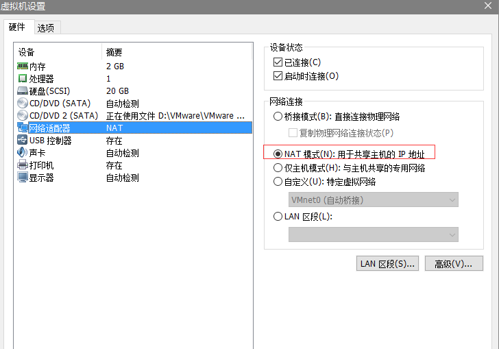
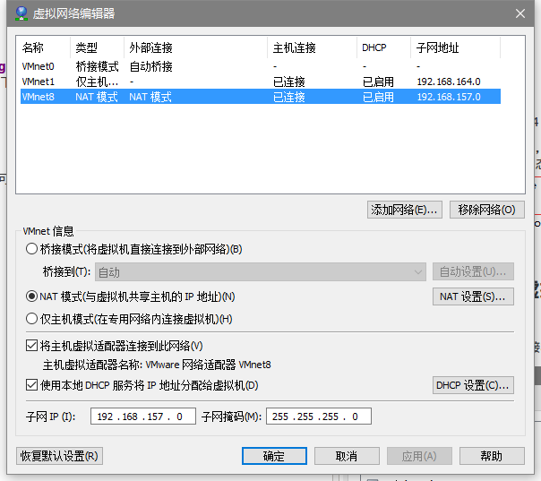
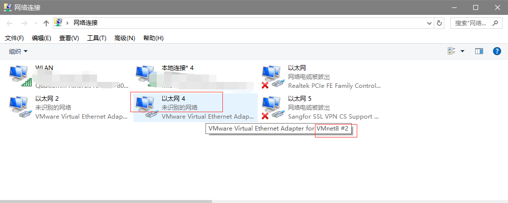
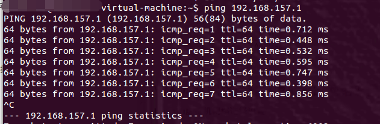
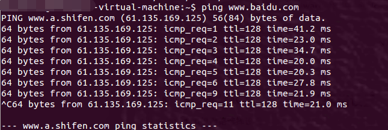

#VMware虚拟机下Ubuntu网络配置问题

##配置网络的背景

在VMware虚拟机中安装了好几个系统，有用于测试的Winxp,也有用于开发Linux的Ubuntu。在使用Ubuntu时时常会遇到网络配置错误的情况，不能联网有时候会很尴尬，之前几次都是临时搜教程配置的，但这中方式有时候很麻烦，时间长了就会忘记。效率也不高，所以这次写点东西用于记录配置的方法。

 
 
##本次配置的环境
1.	Windows10 X64
2.	VMware Workstation 10
3.	Ubuntu12.04/Ubuntu14.04

PS:确保Windows系统下的服务中，<strong>VMware DHCP Service </strong>和<strong> VMware NAT Service</strong> 处于正在运行状态。（在WIN+R运行中输入services.msc可打开查看）运行状态如下图，这是前提。

 
 
##VMware网络设置及虚拟机的网络设置
####Ubuntu虚拟机网络选择设置
这里的虚拟机选取<strong>NAT模式</strong>（桥接模式有点儿问题，如果桥接可行，优先选择桥接吧，会方便很多）

 
####VMware虚拟机网络编辑设置

在VMware的 编辑-> 虚拟网络编辑器 里，会有三种网络选择模式，VMnet0,VMnet1,VMnet8三种（如果设置没有三种可以选 恢复默认设置 对其进行重置），三种配置如下图所示。

 

这里我们使用的NAT模式，所以对应的是<strong>VMnet8</strong>。一般情况下，这里的网络配置会根据安装的虚拟网卡驱动分配的网络地址自动填充。如下图所示，这里是Win10里的网络配置（cmd命令提示符里输入ipconfig可查看）

上图所示有多种适配器配置，这里选取以太网适配器 以太网 4的ip，子网掩码和网关，是按照查看网络连接里VMnet8对应的虚拟网卡确定的，如下图所示。

NAT模式下默认会自动选取NAT设置，默认网关ip为 x.x.x.2,而上图本地分配的是x.x.x.1，具体配置如下图所示。

并且DHCP设置为默认的128～254之间，具体DHCP设置如下图所示。

以上设置最好是在虚拟机处于关闭状态，不过打开着也没什么关系。
 
 
##Ubuntu网络配置

在配置好虚拟机设置后，还需在Ubuntu系统里对属性进行配置，然后重启网络配置。

首先在Ubuntu的终端里查看当前网络配置，这里使用ifconfig（与Win10里不同吧～）。看看有没有eth0和本地环回，这里只是提供查看。

对于系统的配置，主要是在interfaces里，主要指令是：
	
	sudo vi /etc/network/interfaces
	
这里主要是对eth0进行配置，

1.	如果动态获取ip,则可写入内容为：

	auto eth0
	
	iface eth0 inet dhcp

2.	如果是固定静态ip，则在interfaces里写入：

	auto eth0

	iface eth0 inet static

	address 192.168.157.138

	netmask 255.255.255.0

	gateway 192.168.157.2

这里使用的静态ip，那里的address的138可以取3～254之间的任何数字，网关gateway就选用之前那里的NAT网关，具体设置如下图所示。

除了在interfaces里配置之外，还要在resolv.conf里配置域名服务器，终端中的指令为：
	
	sudo vim /etc/resolv.conf
	
在resolv.conf里填入
	
	nameserver 192.168.157.2
	
保存退出。然后重启网络配置,终端指令如下:
	
	sudo /etc/init.d/networking restart
	
如果不出意外的话,终端中的ifconfig可以看到有ip地址和网关的eth0，如果不能显示eth0的话，可以使用指令:
	
	sudo ifconfig eth0 down
	sudo ifconfig eth0 up
	
重新启用eth0，应该可以看到其配置。

如果网络配置不能使用 sudo /etc/init.d/networking restart 启动，可以尝试使用以下代码重启网络服务：
	
	sudo service network-manager restart
	

测试NAT是否配置成功，可以ping主机ip，即192.168.157.1 ，效果如下图：

测试网络是否配置成功，可以ping百度，即 ping www.baidu.com

对于resolv.conf的配置，在下一重启后会被自动清除，为了写入系统配置，并保存下来，使用指令：
	
	sudo vi /etc/resolvconf/resolv.conf.d/base
	

在base里写入和resolv.conf里一样的内容，即nameserver 192.168.157.2，保存即可。

##最后联网成功

ps:这里的sudo vi ..... , vi是使用vim编辑，不会使用vim的,可以换成记事本 gedit 打开。
